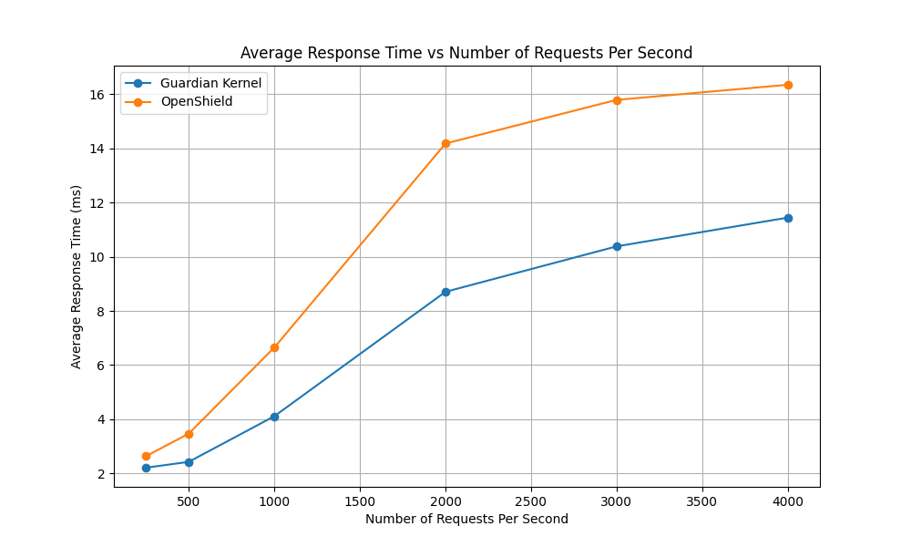
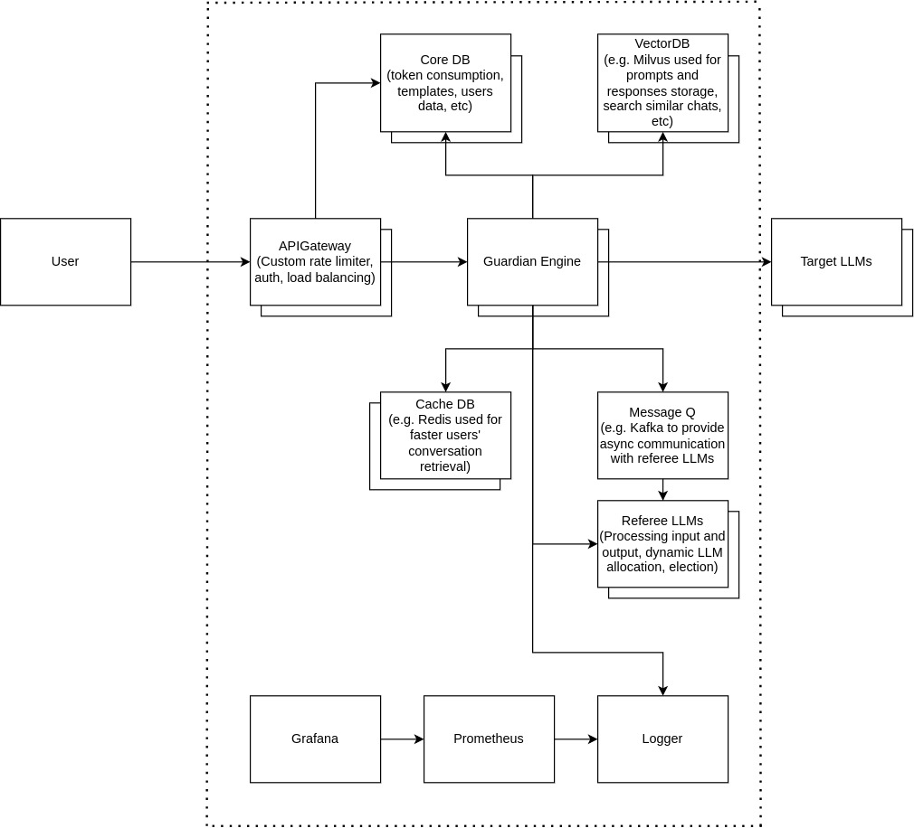

[](https://doi.org/10.5281/zenodo.14211991)
[](https://github.com/AMK9978/Guardian/actions/workflows/go.yml)

# LLM Guardian Kernel
A plug-and-play end-to-end LLM guardian for seamless integration.
The kernel is in charge of fanning out requests to the connected 
security plugins based on user and collecting their responses to judge whether a prompt
is malicious or benign. You can also use the kernel as a rate limiter, authentication unit, or quota management.

## Features & Qualities
- Written in Golang to be super-fast and production-ready
- Microkernel architecture: Open to extension
- Rate limiter
- Supports both HTTP/1.1 and gRPC plugins with reusable gPRC clients
- Define tasks and apply them to users/groups
- SOLID obedient and Database agnostic (MongoDB by default)
- Test covered, CI, linter
- Uses [Google Wire](https://github.com/google/wire) for compile-time dependency injection


## Comparison with OpenShield



As you can see, the Guardian Kernel beats the OpenShield under the same conditions without external calls for 60-second load tests. Unlike OpenShield, the Guardian by default relies on MongoDB (NoSQL) with
denormalized data for faster retrieval. If the external plugin calls get added, the difference can become even more significant as the Guardian Kernel supports gRPC calls with reusable clients.

## Get Started
Docker:
```
git clone git@github.com:amk9978/Guardian.git
docker-compose up --build -d
```

## Architecture
The guardian system uses a micro-kernel architecture designed with the idea of extension in mind:




## Citation
If you use this application, please cite it using the "Cite this repository" above.

## Contribution
I am always welcome to your contributions. Open an issue and/or open a PR accordingly.
This system is designed and the central unit is developed by Amir Karimi (@amk9978).

